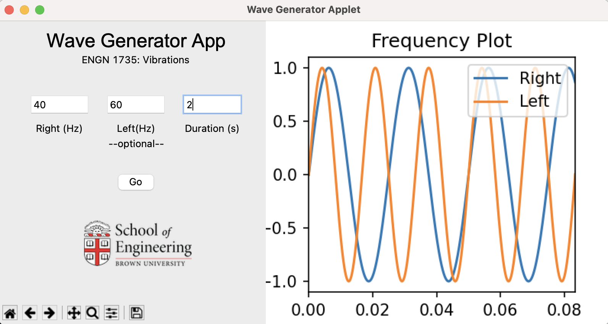

<h1>Waveform Generator</h1>
<h4>Jack-William Barotta, Johnny Boustany, Maya Lewis, and Joshua Neronha</h4>
<h5>Brown University School of Engineering</h5>

As part of our final project for ENGN 1735: Vibrations of Mechanical Systems, we wrote a Python-based app that is able to output a given frequency to both the left and right audio channels, which is the software component of our waveform generator; it allows the user to generate waveforms easily and on-demand.

The software is Python-based and has a tkinter-based GUI and is packaged with pyinstaller as an app that a user can run on both Windows and Mac computers with no Python installation necessary. The program is alpha open-source software with no warranty or guarantees and should be used at your own risk; note that very low frequencies played over your speakers can be damaging and should only be used when connected to a waveform generator. Similarly, take caution to keep the volume low (and do not use headphones!) until you understand how the software behaves.

You can download the alpha version of the software [here](https://github.com/joshuaneronha/wavegenerator/raw/main/dist.zip).

<h5>Note: MacOS will probably not let you open the software by default because we are not "identified" developers! Just right-click on the app icon and hit open and accept the warning if you choose to run our software. It make take some time to start up.</h5>

